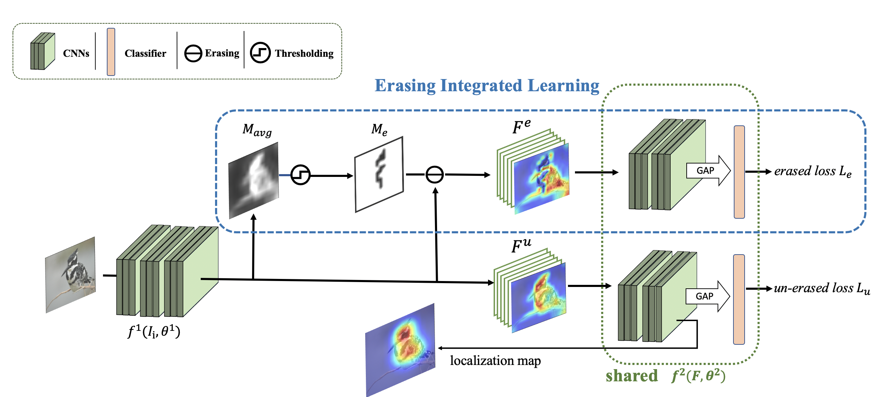

## EIL: A Simple yet Effective Approach for Weakly Supervised Object Localization



#### How to run it

Clone the repo and run:

```
sh EIL_scripts/train_EIL.sh
```

### Pretrained model

We provide the pretrained VGG16-EIL model at [Pretrained VGG-EIL](https://drive.google.com/file/d/1inDkUYKk5wOrWh4Lcfoy0ztxHNdbOY84/view?usp=sharing).